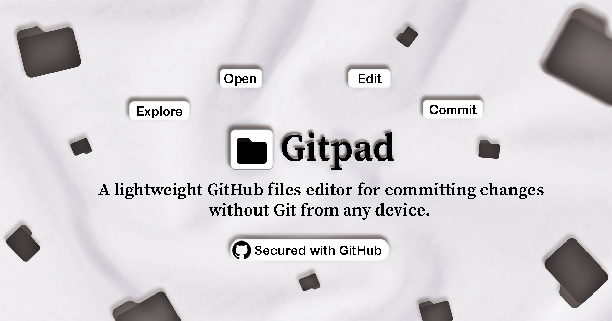

<div align="center">



# GitPad

**Edit any file in your GitHub repos and commit it directly.**
No git, no terminal, no clone, no IDE.

[Live Demo](https://gitnote.vercel.app/) · [Report Bug](../../issues) · [Request Feature](../../issues)


</div>

---

## Why

Most repo edits - a typo in a README, a config value, one line of code - don't need a clone, a terminal, or an IDE. They need: open the file, change the text, commit.

GitPad is built around that single loop, with nothing else in the way. Not a scaled-down IDE, not trying to become one — the smallest possible interface between *"I need to change this file"* and *"it's committed."*

---

## Core Idea: Content, Not Extension

GitHub's Contents API doesn't distinguish `.md` from `.py` from `.html` — only binary versus text, a property of bytes, not filenames. GitPad follows the same rule: **any file that decodes as valid UTF-8 is editable**, regardless of extension.

An extension blocklist (images, video, audio, fonts, archives, executables, office docs) is a UI hint only, to grey out obviously-binary files before you click. The real gate is a strict UTF-8 decode of the actual bytes at open time — correctly accepting a text file with a misleading extension, and rejecting a binary file with an innocent one.

---

## Features

| | |
|---|---|
| **Direct commit, no local state** | Read, edit, commit — all live calls to the GitHub REST API. No clone, no working directory, no merge conflicts. |
| **Byte-level file detection** | Editability decided by decoding the file, not its name — works on config, extensionless, and mislabeled files. |
| **Optimistic concurrency** | Every commit ties to the file's last-read SHA. Upstream change → surfaced as reload-and-retry, never silently overwritten. |
| **Dirty-state protection** | Unsaved changes tracked live, `beforeunload` warning before you can navigate away. |
| **Explicit error states** | Not-found, forbidden, rate-limited, network failure, SHA-mismatch — each handled and surfaced distinctly. |
| **GitHub OAuth, secure by default** | Sign in with GitHub. No PAT, password, or SSH key ever requested or stored. |
| **Lightning fast** | Server Actions, no client-side API calls, no build step to open a file — edit and commit in seconds. |
| **Portable, any device** | Runs in the browser. No install, no local Git setup — works the same on desktop, tablet, or phone. |

---

## Architecture

```
Browser → Next.js → Server Actions → GitHubClient → GitHub REST API
```

| Layer | Choice | Reason |
|---|---|---|
| Auth | Auth.js, GitHub OAuth | No credential handling beyond what GitHub already manages |
| Token storage | Encrypted session cookie, server-only | Never sent to the browser, never in `localStorage` |
| API access | Server Actions → single `GitHubClient` wrapper | One controlled path to the GitHub API, no client-side calls |
| Validation | Path / branch / repo / message / SHA checks on every action | Server re-validates regardless of what the UI already checked |
| Persistence | None beyond the session cookie | GitHub is the only source of truth for file state |

---

## Scope

**Implemented**
Auth, repo listing, branch selection, file browser, open/edit, dirty-state detection, SHA-based commit with concurrency protection, explicit handling for not-found / forbidden / rate-limited / network / SHA-mismatch. Delete exists at the API layer; no UI wired yet.

**Deliberately out of scope**
Syntax highlighting, autocomplete, AI assistance, realtime collaboration, PR/issue/Actions management, create/rename flows. Stays a focused editing tool, not an in-browser IDE.

---

## Roadmap

- [x] OAuth + repo/branch/file browsing
- [x] SHA-based commit with concurrency protection
- [x] Dirty-state + explicit error handling
- [x] Delete UI
- [x] Create / rename flows
- [ ] Multi-file batch commit

---

## Security

- OAuth only — no PAT, password, or SSH key ever requested
- Token is server-only: never reachable from client JS or storage
- Every server action independently validates owner, repo, branch, path, commit message, and SHA — not just the UI
- Path traversal, control characters, and oversized inputs rejected server-side
- Stale-SHA commits mapped to an explicit `SHA_MISMATCH` state, never auto-resolved

---

<div align="center">

Built by [Dipto Thakur](https://diptothakur.vercel.app)

</div>
